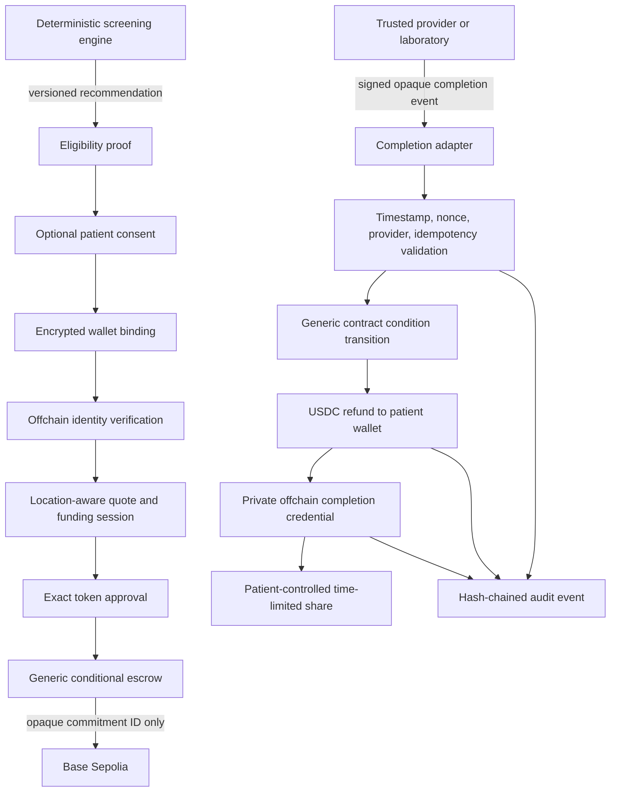

# Architecture

## Principles

- Clinical eligibility remains deterministic and outside the payment subsystem.
- No health or identity data crosses the public-chain boundary.
- Patient identity and wallet binding remain encrypted offchain.
- The completion signal is institutional, opaque, signed, timestamped, nonce-bound,
  idempotent, and matched to an expected provider.
- Refund and credential issuance happen only after completion validation.
- Vendor-specific behavior sits behind adapters.
- Real-money and production networks are denied by configuration, not merely hidden in
  the UI.

## Adapters

| Boundary | Interface | Local implementation | Base Sepolia path |
| --- | --- | --- | --- |
| Wallet | `WalletProviderAdapter` | Dedicated mock binding | Existing OpenRx wallet |
| Payment | `PaymentRailAdapter` | Mock quote/fund/refund | Coinbase Onramp, CDP RPC, CDP account |
| Identity | `IdentityVerificationAdapter` | Mock institutional identity | Future OIDC/SMART/vendor |
| Completion | `ScreeningCompletionAdapter` | HMAC laboratory event | Future partner/FHIR adapter |
| Issuance | `CredentialIssuerAdapter` | EIP-712 offchain credential | Same private format |
| Verification | `CredentialVerifierAdapter` | Signature/trusted issuer | Same, after issuer governance |

## Data Flow



## Public-Chain Boundary

The escrow can store only:

- random 256-bit commitment ID;
- depositor account;
- deposit amount;
- creation timestamp;
- current deadline;
- extension-used flag;
- generic status;
- refund status.

Contract names, functions, events, and metadata are generic. No screening name, code,
result, provider note, appointment data, patient identity, insurer data, or hash derived
from predictable PHI is permitted.

## State Model

```text
created -> funded -> extended
funded|extended -> condition_verified -> refunded
funded|extended -> cancelled -> refunded
funded|extended -> expired -> refunded
funded|extended -> exceptional refund -> refunded
```

Only one extension is permitted. The initial and extension windows default to 90 days.
Cancellation and expiration return the deposit minus the disclosed fee. Completion and
authorized exceptional circumstances return the full amount. The pilot never forfeits
the full deposit.

## Recommendation Binding

`/api/screening/assess` adds a short-lived eligibility token only when all of these are
true:

- the deterministic engine emitted the recommendation;
- status is `due`;
- source URL is HTTPS;
- source and rule versions are present;
- the authenticated patient is bound to the token.

The token contains hashes, timestamps, and a random nonce, not the screening name or
patient data. Commitment creation recomputes the recommendation digest and rejects a
mismatch.

## Storage

The migration adds:

`wallet_bindings`, `identity_verifications`, `screening_commitments`,
`commitment_extensions`, `payment_quotes`, `onramp_sessions`,
`deposit_transactions`, `refund_transactions`, `offramp_sessions`,
`provider_completion_events`, `private_attestations`, `credential_shares`,
`patient_consents`, `webhook_events`, `commitment_audit_events`, and
`pilot_assignments`.

Sensitive provider references and wallet addresses are ciphertext. Searchable values
use separate non-reversible lookup hashes. Audit events form a hash chain.

The local sandbox intentionally uses an in-memory store. It demonstrates behavior but
is not durable across process restarts and is unsuitable for serverless production.

## Coinbase Boundaries

- Server-only CDP credentials create JWTs and access RPC/transaction APIs.
- Buy options are checked before a quote is requested.
- The quote response controls fees, total, purchase amount, and availability text.
- Onramp receives an opaque funding-session reference only.
- The UI opens Coinbase-hosted Onramp rather than embedding an unsupported page.
- Exact USDC allowance is prepared; unlimited approval is never requested.
- Funding is confirmed only after two Base Sepolia confirmations and a matching
  depositor, commitment ID, amount, and escrow event.
- The CDP refund account must have an attached contract-call policy.
- Paymaster policy examples restrict contract and method access.
- Offramp remains unavailable until a location-specific quote can disclose eligibility,
  fees, method, and timing. Refund is never described as a return to the original card
  or bank.

Primary references:

- Coinbase Onramp API: https://docs.cdp.coinbase.com/onramp/reference
- Coinbase webhook verification: https://docs.cdp.coinbase.com/webhooks/verify-signatures
- Coinbase user wallets: https://docs.cdp.coinbase.com/wallets/quickstart/user-auth
- Coinbase smart accounts: https://docs.cdp.coinbase.com/wallets/using-wallets/smart-accounts
- Coinbase Paymaster: https://docs.cdp.coinbase.com/paymaster/introduction/quickstart
- EAS offchain attestations: https://docs.attest.org/docs/easscan/offchain
