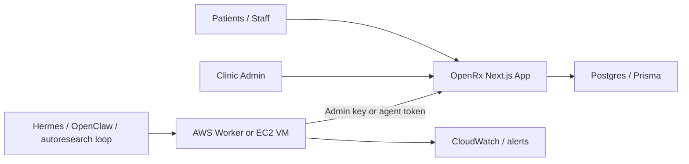

# Researcher VM Integration Plan

This is the practical integration shape for `tools/researcher-vm` with OpenRx, AWS, Hermes, and OpenClaw.

## Current decision

The moved workspace at [`/Users/shardingdog/openrx/tools/researcher-vm`](/Users/shardingdog/openrx/tools/researcher-vm) remains a separate support runtime. It is not bundled into the Next.js app and it should not hold patient-facing product logic.

That separation is deliberate:

- OpenRx app: patient and staff product, auth, PHI boundaries, orchestrator APIs
- researcher-vm: background experimentation, scheduled jobs, Hermes/OpenClaw loops, AWS worker scaffolding

## Target topology

## What should run where

### In OpenRx

- patient chat
- provider search
- screening recommendations
- payments and ledger flows
- care-team review
- orchestrator routing
- admin email workflows

### In `tools/researcher-vm`

- scheduled agent quality checks
- prompt evaluations
- research loops that summarize findings back into OpenRx
- deployment-health sweeps
- periodic calls to `POST /api/openclaw/cron/[jobId]`

## What should not move into the VM

- core PHI storage
- direct database writes into OpenRx production tables
- privileged billing or prescription mutations without an OpenRx API boundary
- anything that bypasses care-team review for high-stakes actions

## Recommended AWS rollout

1. Start with one EC2 research VM for Hermes and exploratory loops.
2. Add one narrow scheduler path using EventBridge or systemd calling the new cron endpoint.
3. Once the prompts and schedules stabilize, move repeatable jobs to Fargate tasks.
4. Keep long-running autonomous experimentation separate from deterministic production cron jobs.

## Suggested environment variables

For the worker:

- `OPENRX_BASE_URL`
- `OPENRX_ADMIN_API_KEY`
- `OPENRX_AGENT_NOTIFY_TOKEN` (optional service auth alternative)
- `OPENCLAW_GATEWAY_URL`
- `OPENCLAW_GATEWAY_TOKEN`
- `AWS_REGION`
- `HERMES_BIN`

## Immediate implementation already added

1. Moved the workspace from the broken root path to:
   - [`/Users/shardingdog/openrx/tools/researcher-vm`](/Users/shardingdog/openrx/tools/researcher-vm)
2. Added OpenRx-specific VM env template:
   - [`/Users/shardingdog/openrx/tools/researcher-vm/deploy/env/openrx-research.example.env`](/Users/shardingdog/openrx/tools/researcher-vm/deploy/env/openrx-research.example.env)
3. Added VM helper scripts to trigger OpenRx cron jobs and poll due work:
   - [`/Users/shardingdog/openrx/tools/researcher-vm/scripts/run-openrx-cron.sh`](/Users/shardingdog/openrx/tools/researcher-vm/scripts/run-openrx-cron.sh)
   - [`/Users/shardingdog/openrx/tools/researcher-vm/scripts/run-openrx-due-jobs.sh`](/Users/shardingdog/openrx/tools/researcher-vm/scripts/run-openrx-due-jobs.sh)
4. Added systemd service templates for job execution:
   - [`/Users/shardingdog/openrx/tools/researcher-vm/deploy/systemd/openrx-cron@.service`](/Users/shardingdog/openrx/tools/researcher-vm/deploy/systemd/openrx-cron@.service)
   - [`/Users/shardingdog/openrx/tools/researcher-vm/deploy/systemd/openrx-scheduler.service`](/Users/shardingdog/openrx/tools/researcher-vm/deploy/systemd/openrx-scheduler.service)
   - [`/Users/shardingdog/openrx/tools/researcher-vm/deploy/systemd/openrx-scheduler.timer`](/Users/shardingdog/openrx/tools/researcher-vm/deploy/systemd/openrx-scheduler.timer)
5. Added a hardened OpenRx cron endpoint:
   - [`/Users/shardingdog/openrx/app/api/openclaw/cron/[jobId]/route.ts`](/Users/shardingdog/openrx/app/api/openclaw/cron/[jobId]/route.ts)

## Next build steps

1. Persist orchestrator state to Postgres.
2. Add a signed cron-job audit table for background runs.
3. Add a dedicated admin screen for background job history and failures.
4. Move literature-refresh and provider-index QA into the background job model.
5. Add a research-to-human-review handoff path for anything that influences clinical recommendations.
