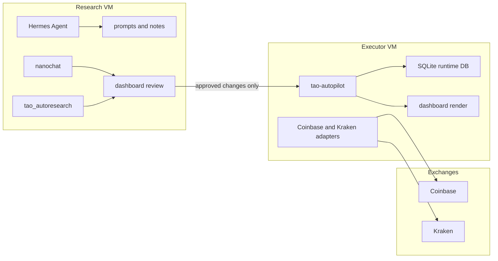

# Deployment Architecture

This is the first deployment shape I would actually use for this project.

## Chosen topology

Use two small VMs, not one giant agent box:

- `executor VM`: holds exchange credentials and is the only machine allowed to place orders
- `research VM`: runs Hermes, nanochat, prompt iteration, and strategy review with no exchange credentials

That split is deliberate. Multi-tenant agent platforms are still good enough for research, but not good enough to be the trust boundary for real exchange execution.

## Why this layout

- The executor side needs low change rate, simple services, and narrow permissions.
- The research side benefits from experimentation, but it should not have any path to withdraw or trade funds.
- Your account is small, so simple infrastructure beats clever infrastructure.

## Machine tree

## Security boundary

Executor VM:

- stores `RESEARCHER_SECRET_CONFIG` outside the repo
- stores exchange key files outside the repo
- runs the autopilot and dashboard services
- sends Telegram alerts
- should use trade-only keys with withdrawals disabled

Research VM:

- stores no Coinbase or Kraken secrets
- can fetch public market data and run `Hermes`, `nanochat`, and `tao_autoresearch`
- can hold prompts, journals, and backtest output
- should never call exchange private APIs

## Storage decision

For the first hosted version, stay on SQLite on the executor VM:

- `runtime/tao_live.db` for bot state and journal
- `runtime/tao_autopilot.db` for heartbeat and loop logs

That is simpler and more reliable than adding Postgres before you need it. Move to Postgres only when you need hosted UI/API access or multiple workers.

## Network and access

- Put both VMs on `Tailscale`
- only allow SSH over the tailnet
- keep the executor VM off the public web if possible
- if you later expose the dashboard, expose a read-only copy from the research VM, not the executor VM

## Services

Executor VM:

- `tao-trader-executor.service`: long-running autopilot
- `tao-trader-dashboard.timer`: refreshes the local HTML dashboard every 5 minutes

Research VM:

- `tao-trader-research.timer`: runs one autoresearch cycle every 6 hours
- optional `tao-trader-hermes-gateway.service`: keeps a Hermes gateway alive after interactive setup

## What I did not choose

- No multi-tenant OpenClaw control plane for live execution
- No shared agent box with exchange secrets
- No Vercel-hosted live worker
- No Kubernetes
- No Postgres-first architecture

Those can come later if the strategy proves it deserves the complexity.

## Upgrade path

Build in this order:

1. Prove the strategy in backtest and paper mode.
2. Run the two-VM setup in `paper`.
3. Add native protective orders and stronger fill reconciliation.
4. Only then move to `manual` or `live`.
5. Add Postgres/API later if you need remote approval and reporting.
