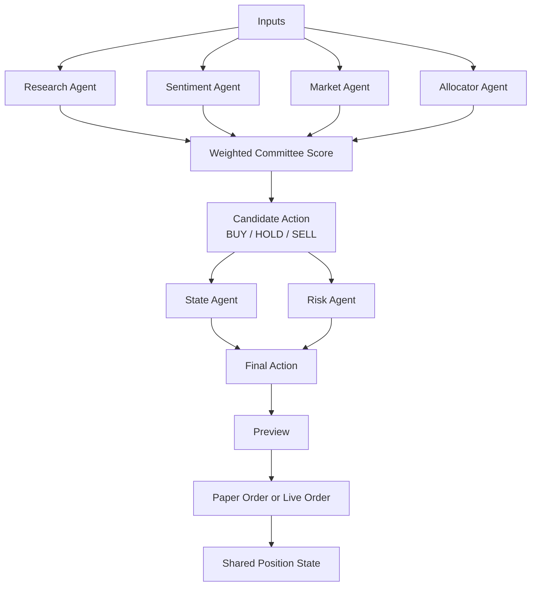
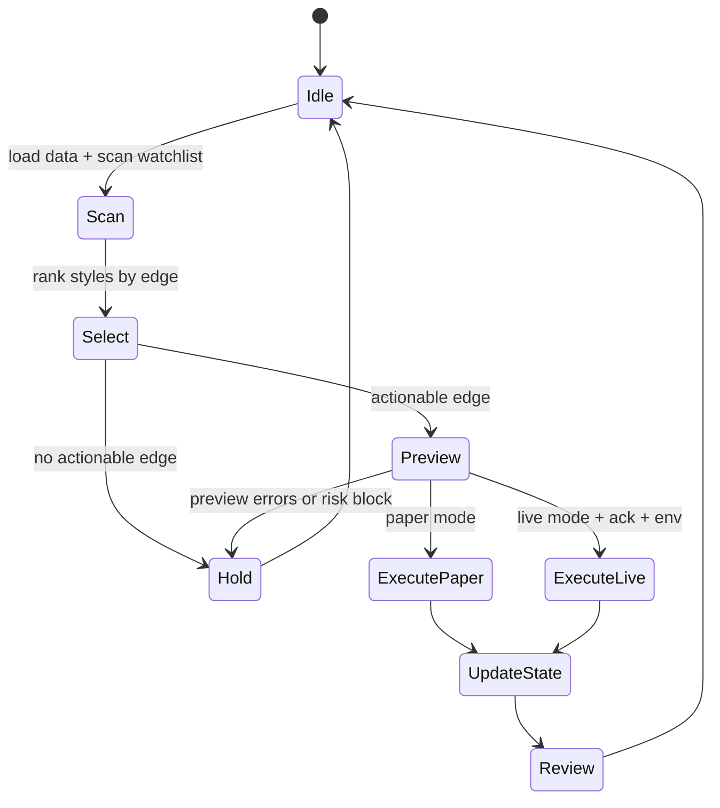

# Machine Tree

This is the runtime decision tree and state machine behind the bot.

## Decision Tree

## Runtime State Machine

## Machine Boundaries

- `scoring.py` decides thesis quality.
- `agents.py` decides style and action.
- `exchange.py` chooses the venue adapter.
- `coinbase.py` and `kraken.py` handle API specifics.
- `cli.py` is the operator entry point.

## Missing Machine Pieces

- no explicit backtest engine
- no style-performance memory
- no risk engine for stops, trailing exits, or drawdown halts
- no reconciliation job that compares expected vs actual exchange fills
- no websocket event loop for lower-latency execution
