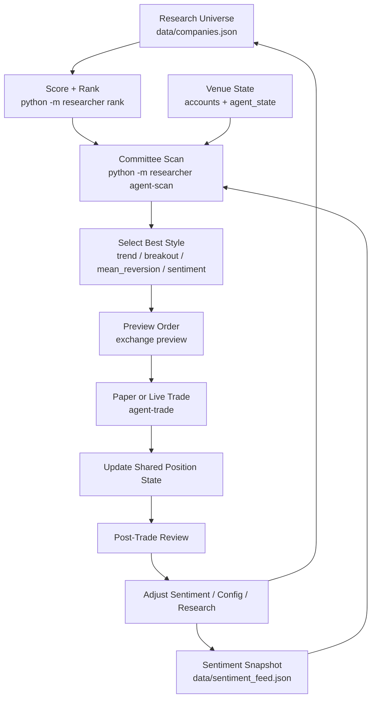

# Work Tree

The system works best when treated as an operator loop instead of a one-shot bot.

## Work Tree

## Operator Sequence

1. Refresh research only when thesis evidence changes.
2. Refresh sentiment whenever the market regime changes.
3. Run a scan before any trade.
4. Prefer the highest-edge style, not the style you happen to like.
5. Review the trade and feed the result back into config and sentiment.

## Missing Work Tree Pieces

- no automated daily sentiment refresh job
- no scheduled style review job
- no PnL feedback step that automatically adjusts confidence in each style
- no archive of old sentiment snapshots for regime comparison
